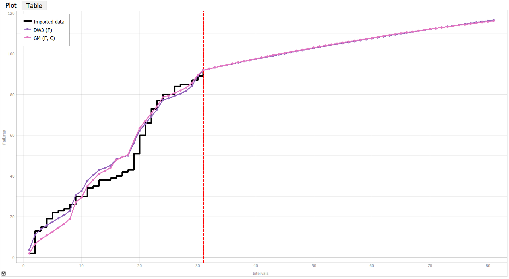

**SENG 438- Software Testing, Reliability, and Quality**

**Lab. Report \#5 – Software Reliability Assessment**

| Group \#:      |  5  |
| -------------- | --- |
| Student Names: |  Nicholas Knapton   |
|                |  Jacob Artuso   |
|                |  Brian Kramer  |
|                |  Colin Christophe   |

# Introduction
In this assignment we have analyzed test data through the use of reliability testing software. We first used a reliability growth assessment tool, C-SFRAT, in order to apply covariate software reliability models in order to select guide models for our data.

Next we created a reliability demonstration chart in order to check whether the mean time to failure was met.
# 

# Assessment Using Reliability Growth Testing 
Model Comparison:

We found the laplace value for each k using the formula 
  

Graphing u(k), we were able to determine that the reliability increases until 17, at that point it decreases. Therefore the data we should proceed with testing is the range of 0 to 17 because reliability starts to decrease after 17. This could point to the system becoming outdated and may not be reflective of the system's normal operational reliability.

Time-between-failure

Failure Intensity

Reliability Graph

To arive on a target failure rate we started by setting the target to various values starting at 1.0 and going down. Observing the results of the graph along the way, our model showed it was unlikely to reach the target intensity rate until 0.6 then got better at 0.5 then finally we arived at the graph shown below which shows a target failure rate of 0.4.

# Assessment Using Reliability Demonstration Chart 
To decide what value we should use for the MTTFmin we looked at what the “Input Event When Observed” value was for the last row of data. Since the value was just below 200,000 (When converted to seconds) and the maximum number of failures we used was 100. We looked for an MTTF that would make the SUT enter the acceptable region on the last “Normalized (Plotted) X Value” without the data points entering the rejection zone. Starting at 2000, we gradually increased our “Per Number of input Events” until we reached a value that satisfies these conditions. This gave us a MTTFmin of 2300. 

We were able to find the MTTF and plot the failures per interval in an RDC. We then plotted double the MTTF as well as half MTTF as shown in the images below. Analysing the graphs, we can see that in the first graph the acceptable failure rate is reached. RDC(normal):

RDC(half MTTF):

RDC(twice MTTF):

# 
The RDC for the halved MTTF has a much shallower slope and reaches the acceptable region in less normalised time units. The RDC plot for the double MTTF has a steeper slope and therefore reaches the reject region sooner and so it fails.

# Advantages/Disadvantages of RDC  
Advantages: 
  -Versatile 
  -Time efficient 
  -Experimentation with different values and what-if's is possible 
Disadvantages: 
  -Cannot find specific values for reliability 
  -Only able to show whether or not SUT is in the acceptable bounds 

# Comparison of Results

# Discussion on Similarity and Differences of the Two Techniques

# How the team work/effort was divided and managed
This lab was done as a group collaboration, with each member contributing at each stage of the lab. We set specifc times for meeting and worked together at those times.
# 

# Difficulties encountered, challenges overcome, and lessons learned
In this lab we encountered many difficulties both learning the software, but also in understanding what we needed to do. We struggled a lot working out which steps to take next.

# Comments/feedback on the lab itself
This was an interesting and challenging lab.
