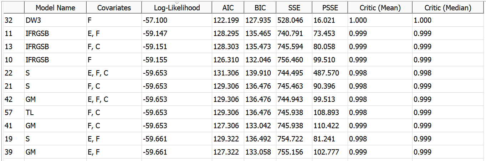

**SENG 438- Software Testing, Reliability, and Quality**

**Lab. Report \#5 – Software Reliability Assessment**

| Group \#:      |  5  |
| -------------- | --- |
| Student Names: |  Nicholas Knapton   |
|                |  Jacob Artuso   |
|                |  Brian Kramer  |
|                |  Colin Christophe   |

# Introduction
In this assignment we have analyzed test data through the use of reliability testing software. We first used a reliability growth assessment tool, C-SFRAT, in order to apply covariate software reliability models in order to select guide models for our data.

Next we created a reliability demonstration chart in order to check whether the mean time to failure was met.
# 

# Assessment Using Reliability Growth Testing 
Model Comparison:

We found the laplace value for each k using the formula 
  
Graphing u(k), we were able to determine that the reliability increases until 17, at that point it decreases. Therefore our range should be 0 to 17.

Time-between-failure

Failure Intensity

Reliability Graph

# Assessment Using Reliability Demonstration Chart 
We were able to find the MTTF and plot the failures per interval in an RDC. We then plotted double the MTTF as well as half MTTF as shown in the images below. Analysing the graphs, we can see that in the first graph the acceptable failure rate is reached. RDC(normal):

RDC(twice MTTF):

RDC(half MTTF):

# 
The RDC for the doubled MTTF has a much shallower slope and reaches the acceptable region in less normalised time units. The RDC plot for the halved MTTF has a steeper slope and therefore reaches the reject region sooner.

# Comparison of Results

# Discussion on Similarity and Differences of the Two Techniques

# How the team work/effort was divided and managed
This lab was done as a group collaboration, with each member contributing at each stage of the lab. We set specifc times for meeting and worked together at those times.
# 

# Difficulties encountered, challenges overcome, and lessons learned
In this lab we encountered many difficulties both learning the software, but also in understanding what we needed to do. We struggled a lot working out which steps to take next.

# Comments/feedback on the lab itself
This was an interesting and challenging lab.
